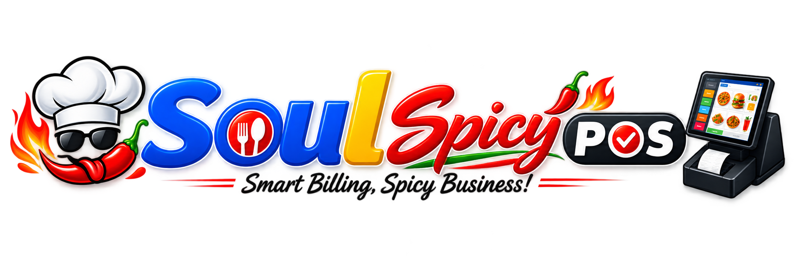
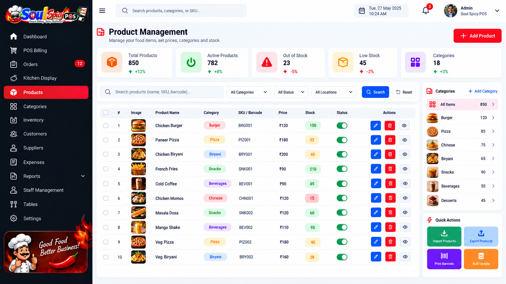
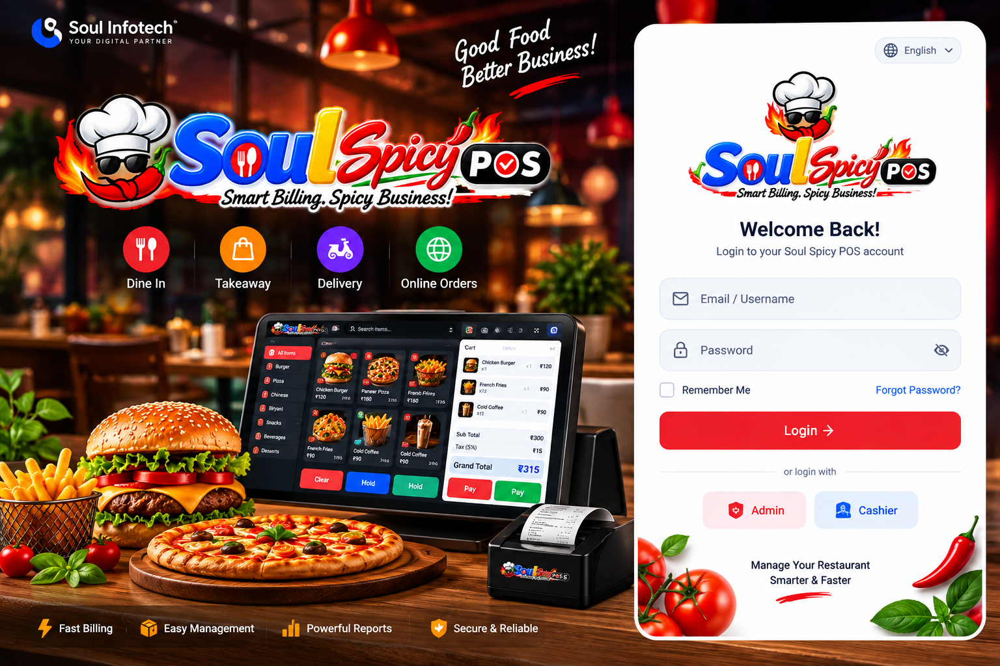
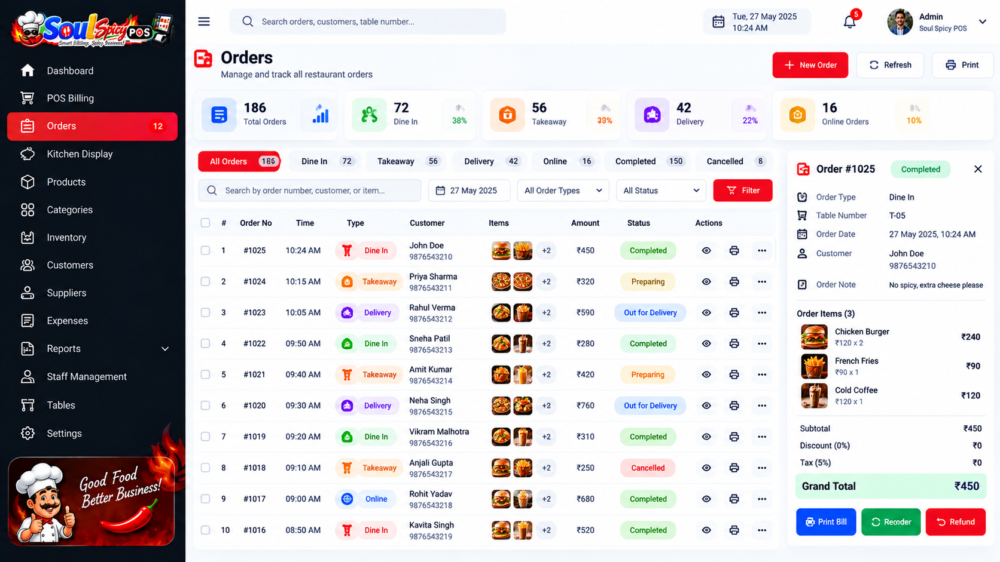
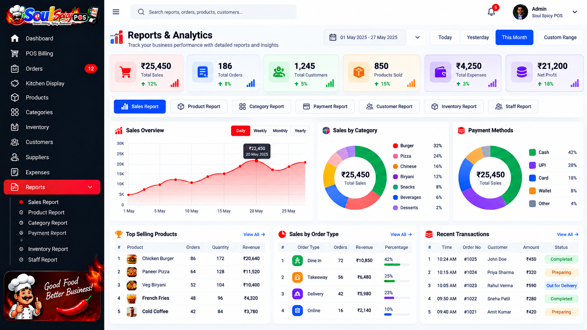

<div align="center">



# 🌶️ Soul Spicy POS

### 🚀 Smart • Fast • Powerful Point of Sale & Restaurant Management

**A modern POS ecosystem built for restaurants, cafés, QSRs, food businesses and retail operations.**

<p>
  
  
  
</p>

<p>
  
  
  
  
</p>

<br>


</div>

---

## ✨ About Soul Spicy POS

**Soul Spicy POS** is a complete Point of Sale and business management solution designed to simplify everyday operations.

From taking orders and generating invoices to managing products, inventory, customers, staff, payments and reports — everything is organized in one powerful platform.

> **Sell faster. Manage smarter. Grow better.**

---

## 🎯 Why Soul Spicy POS?

<table>
<tr>
<td width="25%" align="center">

### ⚡ Fast

Lightning-fast billing and order processing.

</td>

<td width="25%" align="center">

### 📦 Inventory

Keep complete control over your stock.

</td>

<td width="25%" align="center">

### 📊 Analytics

Understand your business with powerful reports.

</td>

<td width="25%" align="center">

### 🔐 Secure

Role-based access and secure data management.

</td>
</tr>
</table>

---

# 🚀 Core Features

<table>
<tr>
<td width="50%">

## 🧾 Smart POS

- ⚡ Fast billing
- 🔎 Product search
- 🛒 Cart management
- 💰 Discounts
- 🧮 Automatic tax calculation
- 💳 Multiple payment methods
- 🧾 Invoice generation
- 🔄 Order hold & resume
- ❌ Cancellation & refund

</td>

<td width="50%">

## 📦 Inventory

- 📦 Stock management
- 🔄 Stock adjustments
- 🛍️ Purchase management
- 👨‍💼 Supplier management
- ⚠️ Low-stock alerts
- 📈 Inventory reports
- 🔍 Product tracking
- 🏷️ SKU & barcode support

</td>
</tr>

<tr>
<td>

## 🍽️ Restaurant Management

- 🪑 Table management
- 🍔 Dine-in orders
- 🥡 Takeaway
- 🚚 Delivery
- 🔄 Order status
- 👨‍🍳 Kitchen workflow
- 📋 KOT management

</td>

<td>

## 👥 Customer Management

- 👤 Customer profiles
- 📞 Contact management
- 🧾 Purchase history
- 💳 Payment history
- 💰 Outstanding balance
- 🎁 Customer loyalty support

</td>
</tr>
</table>

---

# 📊 Business Dashboard

Track your complete business performance from a centralized dashboard.

<div align="center">


</div>

### Dashboard Metrics

```text
┌─────────────────────────────────────────────────────────┐
│                    SOUL SPICY POS                       │
├───────────────┬───────────────┬─────────────────────────┤
│ 💰 Sales      │ 🧾 Orders     │ 👥 Customers            │
│ ₹25,450       │ 186           │ 1,245                   │
├───────────────┼───────────────┼─────────────────────────┤
│ 📦 Products   │ ⚠️ Low Stock  │ 💸 Expenses             │
│ 850           │ 23            │ ₹4,250                  │
└───────────────┴───────────────┴─────────────────────────┘
```

---

# 🖥️ Modern POS Interface

<div align="center">


</div>

Designed for speed, simplicity and minimal training.

### POS Workflow

```text
SELECT PRODUCT
      ↓
ADD TO CART
      ↓
APPLY DISCOUNT / TAX
      ↓
SELECT PAYMENT
      ↓
GENERATE INVOICE
      ↓
ORDER COMPLETED ✅
```

---

# 🍔 Product Management

<div align="center">



</div>

Manage your complete product catalog from a centralized interface.

### Product Capabilities

- Product name
- Product image
- Category
- SKU
- Barcode
- Purchase price
- Selling price
- Tax
- Stock quantity
- Product status
- Product variants

---

# 👨‍🍳 Kitchen Management

Soul Spicy POS can connect the front counter with the kitchen workflow.

```text
NEW ORDER
    ↓
🟡 PENDING
    ↓
🔵 PREPARING
    ↓
🟠 READY
    ↓
🟢 COMPLETED
```

Perfect for:

- Restaurants
- QSRs
- Cafés
- Cloud kitchens
- Food courts

---

# 💳 Payment Management

Support multiple payment methods:

| Payment | Support |
|---|:---:|
| 💵 Cash | ✅ |
| 📱 UPI | ✅ |
| 💳 Card | ✅ |
| 🏦 Bank Transfer | ✅ |
| 👛 Wallet | ✅ |
| 🔀 Split Payment | ✅ |

Payment gateways and third-party providers can be integrated according to deployment requirements.

---

# 📈 Reports & Analytics

Get valuable insights into your business.

### 📊 Sales Reports

- Daily sales
- Weekly sales
- Monthly sales
- Product sales
- Category sales

### 📦 Inventory Reports

- Current stock
- Stock movement
- Low-stock products
- Purchase history

### 💰 Financial Reports

- Revenue
- Expenses
- Profit
- Taxes
- Payment summaries

### 👥 Customer Reports

- Customer purchases
- Customer activity
- Outstanding balances

---

# 👨‍💼 Staff & Role Management

Create customized access levels for your team.

| Role | Access |
|---|---|
| 👑 Administrator | Full system |
| 🧑‍💼 Manager | Operations & reports |
| 💵 Cashier | POS & billing |
| 👨‍🍳 Kitchen Staff | Kitchen orders |
| 📦 Store Staff | Inventory |

---

# 🏪 Perfect For

<div align="center">

| 🍽️ Restaurant | ☕ Café | 🍔 Fast Food |
|---|---|---|
| 🍕 Pizza Shop | 🧁 Bakery | 🥤 Juice Shop |
| 🚚 Cloud Kitchen | 🥡 Takeaway | 🛒 Food Retail |
| 🏨 Hotel | 🌯 QSR | 🍗 Food Court |

</div>

---

# 🛠️ Technology Stack

<div align="center">


</div>

### Architecture

```text
┌──────────────────────────────┐
│       SOUL SPICY POS         │
│      Flutter Application     │
└──────────────┬───────────────┘
               │
               │ REST API
               ▼
┌──────────────────────────────┐
│       Laravel Backend        │
│      Authentication / API    │
└──────────────┬───────────────┘
               │
               ▼
┌──────────────────────────────┐
│          MySQL               │
│    Business Data Storage     │
└──────────────────────────────┘
```

---

# 📱 Application Screenshots

<div align="center">




<br><br>





</div>

---

# ⚙️ Installation

## Requirements

Before installation, make sure you have:

```text
Flutter SDK
Dart SDK
Android Studio
Android SDK
Git
PHP 8.x+
MySQL / MariaDB
Composer
Laravel
```

---

## 1️⃣ Clone Repository

```bash
git clone YOUR_REPOSITORY_URL
```

```bash
cd soul-spicy-pos
```

---

## 2️⃣ Install Flutter Dependencies

```bash
flutter clean
flutter pub get
```

---

## 3️⃣ Configure API

Update your API configuration:

```text
API_BASE_URL=https://your-domain.com/api
```

---

## 4️⃣ Run Application

```bash
flutter devices
```

Then:

```bash
flutter run
```

---

# 🤖 Build Android APK

### Debug

```bash
flutter build apk
```

### Release

```bash
flutter build apk --release
```

### Play Store AAB

```bash
flutter build appbundle --release
```

Output:

```text
build/app/outputs/bundle/release/app-release.aab
```

---

# 🌐 Backend Setup

If using Laravel:

```bash
composer install
```

Create `.env`:

```bash
cp .env.example .env
```

Configure:

```env
APP_NAME="Soul Spicy POS"
APP_ENV=production
APP_DEBUG=false

DB_CONNECTION=mysql
DB_HOST=127.0.0.1
DB_PORT=3306
DB_DATABASE=soul_spicy_pos
DB_USERNAME=your_username
DB_PASSWORD=your_password
```

Generate key:

```bash
php artisan key:generate
```

Run migrations:

```bash
php artisan migrate
```

Clear cache:

```bash
php artisan optimize:clear
```

---

# 🔐 Security

For production deployments:

- 🔒 Always use HTTPS
- 🔑 Protect API credentials
- 🚫 Never commit `.env`
- 🛡️ Use strong passwords
- 👥 Restrict administrator access
- 💾 Maintain regular backups
- 🔄 Keep dependencies updated
- 🔐 Secure payment credentials

---

# 💾 Database Backup

Create backup:

```bash
mysqldump -u USERNAME -p DATABASE_NAME > backup.sql
```

Restore:

```bash
mysql -u USERNAME -p DATABASE_NAME < backup.sql
```

---

# 🧪 Development

Check Flutter:

```bash
flutter doctor
```

Analyze code:

```bash
flutter analyze
```

Run tests:

```bash
flutter test
```

Clean project:

```bash
flutter clean
```

---

# 🗺️ Roadmap

```text
✅ POS Billing
✅ Product Management
✅ Inventory Management
✅ Customer Management
✅ Payment Management
✅ Reports
✅ Staff Management

🚧 Multi-Branch Management
🚧 Advanced CRM
🚧 Online Ordering
🚧 Delivery Management
🚧 WhatsApp Notifications
🚧 Loyalty Program

🔮 AI Business Analytics
🔮 Smart Sales Forecasting
🔮 Automated Inventory Prediction
```

---

# 🌟 Future Vision

Soul Spicy POS is designed to evolve into a complete **restaurant business operating system**.

Future possibilities include:

### 🤖 AI Analytics

Predict:

- Sales trends
- High-performing products
- Inventory requirements
- Customer behavior

### 📱 Online Ordering

Connect POS with:

- Website
- Mobile App
- QR ordering
- Online food ordering

### 💬 WhatsApp Integration

Send:

- Order confirmation
- Invoice
- Payment confirmation
- Customer notifications

---

# 🏆 Product Highlights

<div align="center">

### ⚡ Fast Billing

### 📦 Smart Inventory

### 📊 Powerful Analytics

### 💳 Flexible Payments

### 👥 Customer Management

### 👨‍🍳 Kitchen Operations

### 🔐 Secure Access

### 📱 Modern UI

</div>

---

# 🏢 Developed By

<div align="center">


### Soul Infotech

**Web Development • App Development • Digital Marketing • Software Solutions**

🌐 **https://soulinfotech.org**

</div>

---

# 📞 Support

For technical support, customization, deployment and integration:

**Soul Infotech**

📧 support@soulinfotech.org

🌐 https://soulinfotech.org

---

# 📄 License

Copyright © **Soul Infotech**

All rights reserved.

This software is proprietary unless otherwise specified by the applicable license agreement.

Unauthorized copying, redistribution, resale or commercial distribution is prohibited.

---

<div align="center">

## 🌶️ Soul Spicy POS

### **Simplify Billing. Manage Better. Grow Faster.**

<br>


<br><br>

⭐ **Star this repository if you like the project!**

</div>
